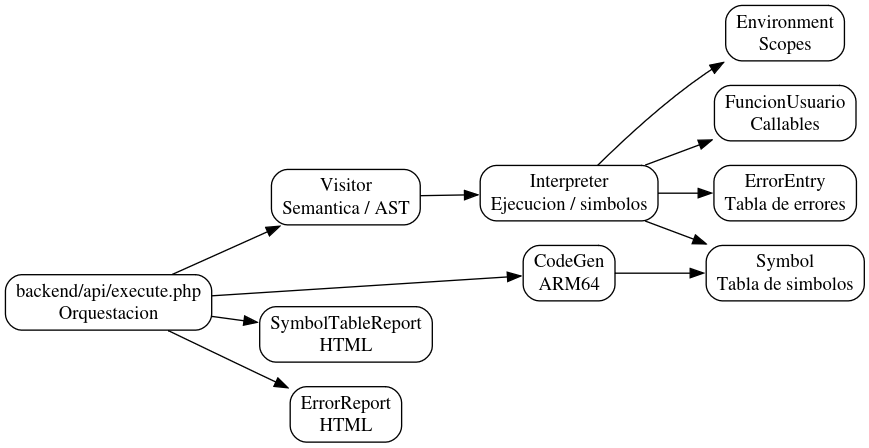

# Diagrama de Clases

Diagrama resumido de la arquitectura principal del proyecto.

Fuente Graphviz del mismo diagrama: `docs/photos/diagrama_clases.png`.

## Lectura rapida
- `Visitor` mantiene la capa semantica/interprete.
- `CodeGen` produce el ARM64.
- `execute.php` coordina analisis, codegen y serializacion JSON.
- `SymbolTableReport` y `ErrorReport` generan los reportes HTML usados por la GUI.