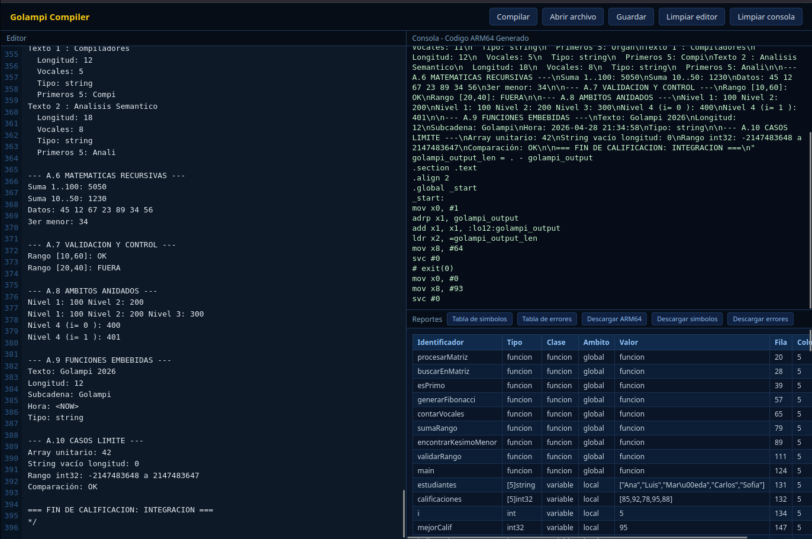
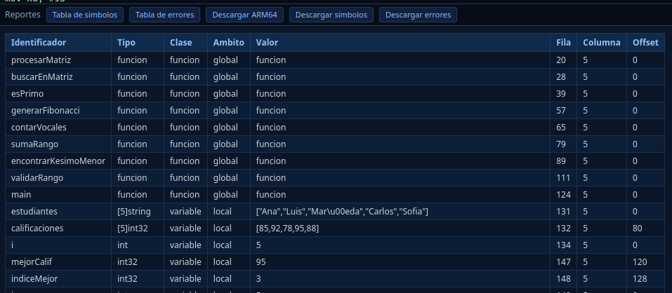
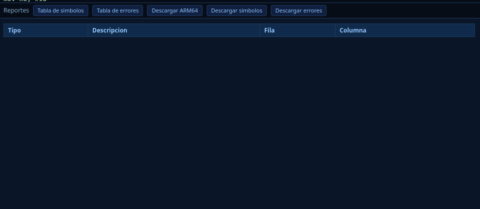
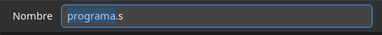

# Manual de Usuario

## 1. Requisitos
- PHP 8.1 o superior.
- Composer instalado.
- Servidor local con acceso al navegador.

## 2. Instalacion
1. Abrir una terminal en la carpeta `Proyecto 2`.
2. Ejecutar `composer install` si todavia no estan las dependencias.
3. Ejecutar `bash build.sh` solo si cambiaste la gramatica ANTLR.

## 3. Ejecucion local
1. Iniciar el servidor PHP:
   ```bash
   php -S localhost:8000 -t .
   ```
2. Abrir en el navegador:
   ```
   http://localhost:8000/frontend/index.html
   ```

## 4. Uso de la GUI
1. Escribir codigo Golampi en el editor.
2. Presionar **Compilar**.
3. La consola muestra el ARM64 generado o los errores encontrados.
4. Usar **Tabla de simbolos** y **Tabla de errores** para ver los reportes.
5. Usar **Descargar ARM64** para guardar el archivo `.s` generado.
6. Usar **Descargar simbolos** y **Descargar errores** para exportar reportes HTML.

## 5. Capturas sugeridas
### 5.1 GUI principal


### 5.2 Resultado de compilacion


### 5.3 Tabla de simbolos


### 5.4 Tabla de errores


### 5.5 Descarga de ARM64


## 6. Flujo de trabajo recomendado
1. Probar primero un programa pequeno.
2. Revisar que no existan errores semanticos.
3. Compilar y verificar el ARM64 generado.
4. Correr los archivos de prueba en `test/test1/` para validar cambios.
5. Si queres validar ejecucion real, ensamblar el `.s` con la toolchain AArch64 y correrlo en QEMU.

## 7. Validacion del ARM64
El codigo ARM64 generado por la GUI no se queda solo en pantalla: puede validarse de dos maneras.

1. **Validacion rapida**: comparar la salida ARM64 generada por la GUI con la salida del interprete en la consola.
2. **Validacion completa**: ensamblar, enlazar y ejecutar el `.s` en QEMU usando la suite de pruebas.

Ejemplo de validacion completa:

```bash
cd "Proyecto 2"
for f in test/archivosEntrada/*.go; do ./test/run_e2e_arm64.sh "$f"; done
```

## 8. Problemas comunes
- Si el navegador no carga, verificar que el servidor PHP siga corriendo.
- Si la consola muestra errores, revisar lineas y columnas del reporte.
- Si cambiaste la gramatica, volver a regenerar los archivos ANTLR.