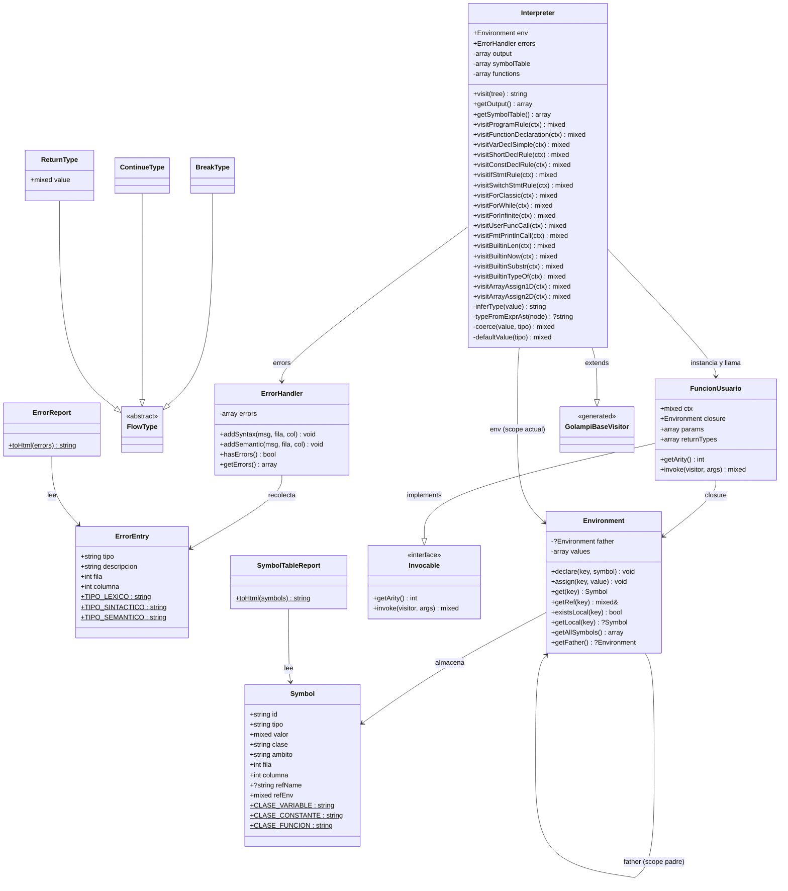

# Diagrama de Clases — Backend PHP

**Proyecto:** Golampi Interpreter  
**Curso:** Organización de Lenguajes y Compiladores 2 — Sección B  
**USAC — 1er Semestre 2026**

---

## 1. Diagrama General (Mermaid)



---

## 2. Descripción de Clases

### 2.1 `Symbol` — `backend/models/Symbol.php`

Representa una entrada en la tabla de símbolos. Cada variable, constante o función declarada en el programa Golampi tiene un `Symbol` asociado.

| Propiedad | Tipo | Descripción |
|-----------|------|-------------|
| `id` | `string` | Nombre del identificador |
| `tipo` | `string` | Tipo Golampi: `int32`, `float32`, `[5]int32`, `funcion`, etc. |
| `valor` | `mixed` | Valor actual: escalar, array PHP, o `null` |
| `clase` | `string` | `variable`, `constante` o `funcion` |
| `ambito` | `string` | `global` o `local` |
| `fila` | `int` | Línea del código fuente donde fue declarado |
| `columna` | `int` | Columna del código fuente |
| `refName` | `?string` | Nombre de la variable original (solo en byRef) |
| `refEnv` | `mixed` | Entorno de la variable original (solo en byRef) |

---

### 2.2 `ErrorEntry` — `backend/models/ErrorEntry.php`

Registro de errores léxicos, sintácticos y semánticos capturados durante la ejecución.

| Propiedad | Tipo | Descripción |
|-----------|------|-------------|
| `tipo` | `string` | `"lexico"`, `"sintactico"` o `"semantico"` |
| `descripcion` | `string` | Mensaje descriptivo del error |
| `fila` | `int` | Línea donde ocurrió el error |
| `columna` | `int` | Columna donde ocurrió el error |

---

### 2.3 `Environment` — `backend/interpreter/Environment.php`

Implementa entornos de ejecución anidados usando el patrón **parent pointer**. Cada bloque `{ }` o llamada a función crea un nuevo `Environment` cuyo padre es el entorno que lo contiene.

| Método | Descripción |
|--------|-------------|
| `declare(key, symbol)` | Declara un símbolo en el scope **actual** |
| `assign(key, value)` | Asigna un valor subiendo la cadena de scopes. Si el símbolo tiene `refName`, propaga el cambio al entorno original (paso por referencia) |
| `get(key)` | Busca y retorna el `Symbol` subiendo la cadena de scopes |
| `getRef(key)` | Retorna referencia PHP al valor (usado internamente para byRef) |
| `existsLocal(key)` | Verifica existencia solo en el scope actual (sin subir) |
| `getAllSymbols()` | Retorna todos los símbolos del scope para la tabla de símbolos |

---

### 2.4 `Invocable` — `backend/interpreter/Invocable.php`

Interfaz que deben implementar todos los objetos invocables del intérprete.

| Método | Descripción |
|--------|-------------|
| `getArity()` | Retorna el número de parámetros esperados |
| `invoke(visitor, args)` | Ejecuta la función con los argumentos dados |

---

### 2.5 `FuncionUsuario` — `backend/interpreter/FuncionUsuario.php`

Representa una función definida por el usuario. Captura el entorno léxico en el momento de su definición (**closure**) y lo usa como padre al crear el entorno de ejecución.

| Propiedad/Método | Descripción |
|-----------------|-------------|
| `ctx` | Nodo CST `FunctionDeclaration` de ANTLR4 |
| `closure` | Entorno capturado al momento de declarar la función |
| `params` | Lista de `['name', 'type', 'byRef']` por parámetro |
| `returnTypes` | Lista de tipos de retorno (puede ser múltiple) |
| `invoke(visitor, args)` | Crea un nuevo `Environment`, vincula argumentos (por valor o por referencia), ejecuta el bloque y retorna el resultado |

**Mecanismo de paso por referencia:**  
Cuando un argumento es `['__ref__' => 'nombre', '__env__' => $env]`, el `Symbol` creado para ese parámetro almacena `refName` y `refEnv`. Toda asignación a ese símbolo se propaga automáticamente al entorno original vía `Environment::assign()`.

**Múltiples retornos:**  
Si la función retorna más de un valor, el resultado se envuelve como `['__multi__' => [val1, val2, ...]]` para que el llamador pueda asignarlo a múltiples variables.

---

### 2.6 `FlowType / BreakType / ContinueType / ReturnType` — `backend/interpreter/FlowTypes.php`

Jerarquía de clases usada para implementar el control de flujo no local. El `Interpreter` retorna instancias de estas clases desde los `visit*` en lugar de lanzar excepciones.

| Clase | Uso |
|-------|-----|
| `BreakType` | Señaliza la salida de un bucle `for` |
| `ContinueType` | Señaliza la continuación de la siguiente iteración |
| `ReturnType` | Transporta el valor de retorno de una función |

---

### 2.7 `ErrorHandler` — `backend/interpreter/ErrorHandler.php`

Recolecta errores sin detener la ejecución, permitiendo reportar múltiples errores en una sola pasada.

| Método | Descripción |
|--------|-------------|
| `addSyntax(msg, fila, col)` | Agrega un error léxico o sintáctico |
| `addSemantic(msg, fila, col)` | Agrega un error semántico |
| `hasErrors()` | Retorna `true` si hay algún error registrado |
| `getErrors()` | Retorna el array de `ErrorEntry` |

---

### 2.8 `Interpreter` — `backend/interpreter/Interpreter.php`

Clase principal del intérprete. Extiende `GolampiBaseVisitor` (generado por ANTLR4) e implementa el patrón **Visitor** sobre el CST.

**Flujo de ejecución:**

```
visit(program)
  └─ visitProgramRule()
       ├─ Fase 1: Hoisting — registrar todas las funciones en $this->functions[]
       └─ Fase 2: Ejecutar main()
            └─ FuncionUsuario::invoke()
                 └─ visit(block)
                      └─ visit(stmt*)
                           └─ visit(expr)
```

**Métodos principales:**

| Grupo | Métodos |
|-------|---------|
| **Declaraciones** | `visitVarDeclSimple`, `visitShortDeclRule`, `visitConstDeclRule` |
| **Asignaciones** | `visitSimpleAssign`, `visitCompoundAssignRule`, `visitArrayAssign1D`, `visitArrayAssign2D` |
| **Control de flujo** | `visitIfStmtRule`, `visitSwitchStmtRule`, `visitForClassic`, `visitForWhile`, `visitForInfinite` |
| **Funciones** | `visitFunctionDeclaration`, `visitUserFuncCall` |
| **Expresiones** | `visitAddExpr`, `visitMulExpr`, `visitRelExpr`, `visitAndExpr`, `visitOrExpr`, `visitNotExpr`, `visitNegExpr` |
| **Literales** | `visitIntLit`, `visitFloatLit`, `visitStringLit`, `visitRuneLit`, `visitTrueLit`, `visitFalseLit`, `visitNilLit` |
| **Arreglos** | `visitArrayLit1D`, `visitArrayLit2D`, `visitArrayAccess1D`, `visitArrayAccess2D` |
| **Builtins** | `visitFmtPrintlnCall`, `visitBuiltinLen`, `visitBuiltinNow`, `visitBuiltinSubstr`, `visitBuiltinTypeOf` |
| **Internos** | `inferType()`, `typeFromExprAst()`, `coerce()`, `defaultValue()` |

---

### 2.9 `SymbolTableReport` — `backend/reports/SymbolTableReport.php`

Genera la tabla de símbolos en formato HTML a partir de un array de `Symbol`.

```
toHtml(Symbol[]) → string HTML con <table>
```

---

### 2.10 `ErrorReport` — `backend/reports/ErrorReport.php`

Genera la tabla de errores en formato HTML a partir de un array de `ErrorEntry`.

```
toHtml(ErrorEntry[]) → string HTML con <table>
```

---

## 3. Flujo de Datos entre Clases

```
execute.php
    │
    ├─► GolampiLexer (ANTLR4 generado)
    │       └── tokeniza el código fuente
    │
    ├─► GolampiParser (ANTLR4 generado)
    │       └── construye el CST (árbol sintáctico concreto)
    │
    ├─► Interpreter.visit(CST)
    │       ├── crea Environment global
    │       ├── Fase Hoisting: crea FuncionUsuario[] en $functions[]
    │       ├── invoca FuncionUsuario(main)
    │       │       ├── crea Environment local (hijo del global)
    │       │       ├── recorre statements del bloque
    │       │       │     ├── evalúa expresiones recursivamente
    │       │       │     ├── declara/asigna Symbols en Environment
    │       │       │     └── retorna FlowType si hay break/continue/return
    │       │       └── retorna valor o null
    │       └── recolecta output[] y symbolTable[]
    │
    ├─► SymbolTableReport.toHtml(symbolTable[]) → HTML
    ├─► ErrorReport.toHtml(errors[]) → HTML
    │
    └─► JSON { output, errors[], symbols[], errorsHtml, symbolsHtml }
```

---

## 4. Clases Generadas por ANTLR4 (no editar)

Ubicadas en `backend/generated/`:

| Archivo | Descripción |
|---------|-------------|
| `GolampiLexer.php` | Analizador léxico — tokeniza el código fuente |
| `GolampiParser.php` | Analizador sintáctico — construye el CST |
| `GolampiBaseVisitor.php` | Implementación base del patrón Visitor (todos los métodos retornan `null`) |
| `GolampiVisitor.php` | Interfaz del Visitor |

> Estos archivos se regeneran ejecutando `bash build.sh` desde la raíz del proyecto.  
> **Nunca se editan manualmente.**
