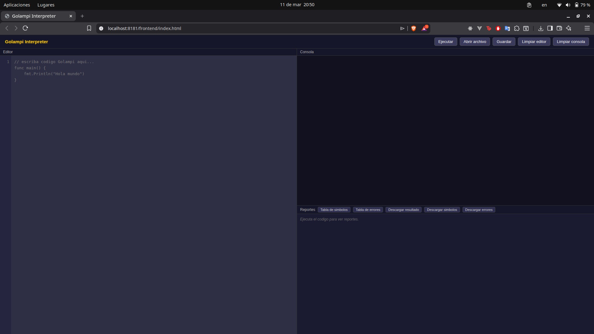
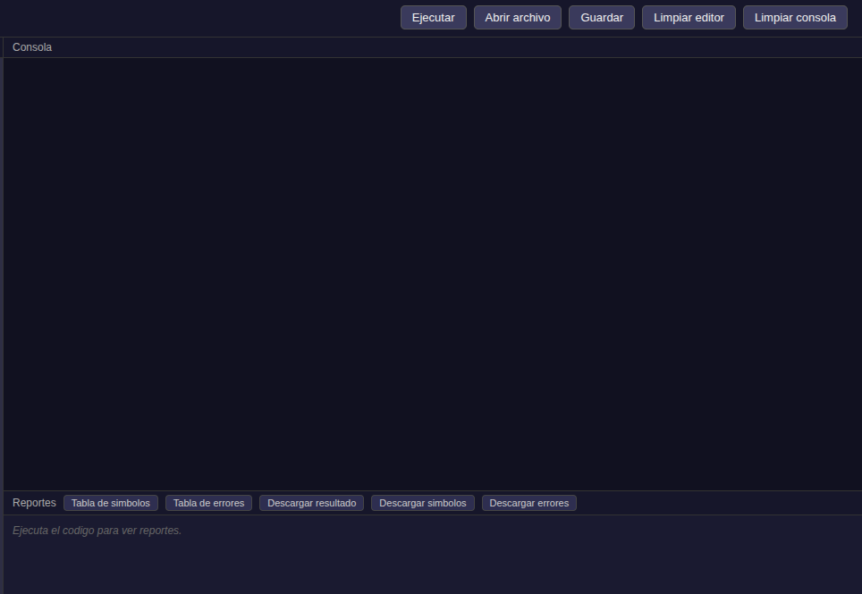

# Manual de Usuario — Golampi Interpreter

**Proyecto:** Golampi Interpreter  
**Curso:** Organización de Lenguajes y Compiladores 2 — Sección B  
**Auxiliar:** rubenralda  
**USAC — 1er Semestre 2026**

---

## 1. Introducción

**Golampi Interpreter** es una aplicación web que permite escribir, ejecutar y
depurar programas escritos en el lenguaje académico **Golampi** — un lenguaje
estáticamente tipado con sintaxis inspirada en Go, diseñado para demostrar los
conceptos de análisis léxico, sintáctico y semántico.

La aplicación consta de:
- Un **editor de código** con resaltado de sintaxis.
- Una **consola de salida** que muestra el resultado de la ejecución.
- Un **panel de reportes** con la tabla de símbolos y la tabla de errores.
- Botones de **descarga** para exportar los reportes.

---

## 2. Prerrequisitos

| Herramienta | Versión mínima | Uso |
|-------------|---------------|-----|
| **PHP** | 8.1 | Servidor integrado + intérprete |
| **Composer** | 2.x | Instalar dependencias PHP |
| **Java** | 11 | Solo para regenerar el parser desde la gramática |
| **ANTLR4** | 4.13 | Solo para regenerar el parser desde la gramática |

> Java y ANTLR4 **solo son necesarios** si se modifica la gramática (`grammar/Golampi.g4`).
> Para ejecutar la aplicación tal como está entregada, basta con PHP y Composer.

---

## 3. Instalación

### Paso 1 — Clonar o descomprimir el proyecto

Ubicarse dentro de la carpeta del proyecto:

```bash
cd Proyecto1
```

### Paso 2 — Instalar dependencias PHP

```bash
composer install
```

Esto descarga el runtime de ANTLR4 para PHP en la carpeta `vendor/`.

### Paso 3 — (Opcional) Regenerar el parser

Solo es necesario si se modificó `grammar/Golampi.g4`:

```bash
bash build.sh
```

Los archivos se depositan en `backend/generated/` y **no deben editarse manualmente**.

---

## 4. Ejecutar el Servidor

Desde la raíz del proyecto (`Proyecto1/`):

```bash
php -S localhost:8181 -t .
```

Luego abrir en el navegador:

```
http://localhost:8181/frontend/index.html
```

> El flag `-t .` es obligatorio: le indica a PHP que sirva desde la raíz del
> proyecto para que las rutas `backend/api/execute.php` resuelvan correctamente.
>
> Se puede usar cualquier puerto libre (8080, 8181, 9000, etc.).

---

## 5. Interfaz de Usuario

### 5.1 Vista General

<!-- CAPTURA: Vista completa de la interfaz con editor, consola y panel de reportes -->


La interfaz se divide en tres secciones:

| Sección | Descripción |
|---------|-------------|
| **Barra de acciones** | Botones: Ejecutar, Cargar archivo, Limpiar editor, Descargar reportes |
| **Editor de código** | Área de escritura con resaltado de sintaxis para Golampi |
| **Panel derecho** | Consola de salida + panel de reportes (tabla de símbolos / errores) |

---

### 5.2 Barra de Acciones

<!-- CAPTURA: Barra de acciones con botones resaltados -->


| Botón | Función |
|-------|---------|
| **▶ Ejecutar** | Envía el código al servidor y muestra el resultado en la consola |
| **📂 Cargar archivo** | Abre un selector de archivos para cargar un `.go` local |
| **🗑 Limpiar** | Limpia el contenido del editor y la consola |
| **⬇ Resultado** | Descarga la salida de la consola como `resultado.txt` |
| **⬇ Símbolos** | Descarga la tabla de símbolos como `tabla-simbolos.html` |
| **⬇ Errores** | Descarga la tabla de errores como `tabla-errores.html` |

---

### 5.3 Editor de Código
- Soporta resaltado de sintaxis (palabras clave, literales, comentarios).
- Se puede escribir directamente o cargar un archivo externo con el botón **Cargar**.
- El contenido se mantiene entre ejecuciones hasta que se presione **Limpiar**.

---

### 5.4 Consola de Salida

- Muestra la salida producida por `fmt.Println(...)` en el programa.
- Si hay errores (léxicos, sintácticos o semánticos), se muestran al final de la consola en formato:
  ```
  --- Errores ---
  [semantico] Linea 5, Col 4: Variable 'x' no declarada.
  ```

---

### 5.5 Panel de Reportes

El panel tiene dos botones para alternar entre reportes:

#### Tabla de Símbolos

Muestra todos los identificadores del programa con su información:

| Columna | Descripción |
|---------|-------------|
| Identificador | Nombre de la variable, constante o función |
| Tipo | Tipo Golampi (`int32`, `float64`, `[5]int32`, `funcion`, etc.) |
| Clase | `variable`, `constante` o `funcion` |
| Ámbito | `global` o `local` |
| Valor | Valor final al terminar la ejecución |
| Fila | Línea del código fuente donde fue declarado |
| Columna | Columna del código fuente |


#### Tabla de Errores

Muestra los errores detectados durante la ejecución:

| Columna | Descripción |
|---------|-------------|
| Tipo | `lexico`, `sintactico` o `semantico` |
| Descripción | Mensaje del error |
| Fila | Línea donde ocurrió |
| Columna | Columna donde ocurrió |

---

## 6. Flujo de Trabajo Típico

1. Escribir o cargar código Golampi en el editor.
2. Presionar **▶ Ejecutar**.
3. Ver el resultado en la consola de salida.
4. Revisar la tabla de símbolos con el botón **Símbolos** del panel.
5. Si hay errores, revisarlos con el botón **Errores** del panel.
6. Descargar los reportes con los botones de descarga.

---

## 7. Ejemplos de Uso

### 7.1 Programa Básico

```go
func main() {
    x := 42
    y := 3.14
    nombre := "Golampi"
    fmt.Println("Entero:", x)
    fmt.Println("Flotante:", y)
    fmt.Println("Nombre:", nombre)
}
```

**Salida esperada:**
```
Entero: 42
Flotante: 3.14
Nombre: Golampi
```

---

### 7.2 Control de Flujo

```go
func main() {
    for i := 1; i <= 5; i++ {
        if i % 2 == 0 {
            fmt.Println(i, "es par")
        } else {
            fmt.Println(i, "es impar")
        }
    }
}
```

**Salida esperada:**
```
1 es impar
2 es par
3 es impar
4 es par
5 es impar
```

---

### 7.3 Funciones y Paso por Referencia

```go
func duplicar(n *int32) {
    n = n * 2
}

func main() {
    var valor int32 = 10
    fmt.Println("Antes:", valor)
    duplicar(&valor)
    fmt.Println("Después:", valor)
}
```

**Salida esperada:**
```
Antes: 10
Después: 20
```

---

### 7.4 Arreglos

```go
func main() {
    numeros := [5]int32{10, 20, 30, 40, 50}
    fmt.Println("Longitud:", len(numeros))
    fmt.Println("Elemento 2:", numeros[2])

    numeros[2] = 99
    fmt.Println("Modificado:", numeros[2])
}
```

**Salida esperada:**
```
Longitud: 5
Elemento 2: 30
Modificado: 99
```

---

### 7.5 Funciones Embebidas

```go
func main() {
    texto := "Universidad San Carlos"
    fmt.Println("Longitud:", len(texto))
    fmt.Println("Subcadena:", substr(texto, 0, 11))
    fmt.Println("Tipo:", typeOf(texto))
    fmt.Println("Fecha:", now())
}
```

**Salida esperada:**
```
Longitud: 22
Subcadena: Universidad
Tipo: string
Fecha: 2026-03-11 10:30:00
```

---

## 8. Descripción de Reportes Descargables

### 8.1 `resultado.txt`

Archivo de texto plano con el contenido exacto de la consola de salida — la
salida producida por `fmt.Println` del programa ejecutado.

### 8.2 `tabla-simbolos.html`

Archivo HTML con la tabla de símbolos del último programa ejecutado. Incluye
todas las variables, constantes y funciones declaradas, con sus tipos, valores
finales, clase y posición en el código fuente.

Se puede abrir directamente en cualquier navegador sin conexión.

### 8.3 `tabla-errores.html`

Archivo HTML con todos los errores detectados (léxicos, sintácticos y semánticos)
durante la última ejecución. Incluye el tipo de error, la descripción y la
ubicación en el código fuente.

---

## 9. Errores Comunes

| Síntoma | Causa probable | Solución |
|---------|---------------|----------|
| La consola muestra "Error de red" | El servidor PHP no está corriendo | Ejecutar `php -S localhost:8181 -t .` |
| La consola queda en "Ejecutando..." | El servidor tardó demasiado (programa con bucle infinito sin break) | Agregar `break` al bucle o reiniciar el servidor |
| Error `[sintactico]` en línea 1 | El código tiene un error de sintaxis | Revisar la gramática: palabras clave, llaves, paréntesis |
| Error `Variable 'x' no declarada` | Se usó una variable sin declarar | Declarar con `var x tipo` o `x := valor` antes de usarla |
| `typeOf` retorna un tipo inesperado | El tipo depende del modo de declaración | Ver tabla de typeOf en [gramatica.md](gramatica.md) |

---

## 10. Regenerar el Parser (avanzado)

Si se modifica `grammar/Golampi.g4`, es necesario regenerar los archivos PHP:

```bash
cd Proyecto1
bash build.sh
```

El script `build.sh` ejecuta internamente:
```bash
java -jar antlr-4.13.2-complete.jar -Dlanguage=PHP -package Golampi \
    -visitor -o backend/generated/ grammar/Golampi.g4
```

Los archivos generados en `backend/generated/` **nunca se editan manualmente** —
se sobreescriben en cada regeneración.

---

## 11. Estructura del Proyecto (Referencia)

```
Proyecto1/
├── grammar/
│   └── Golampi.g4              ← gramática ANTLR4 (fuente de verdad)
├── backend/
│   ├── bootstrap.php           ← autocarga de clases
│   ├── generated/              ← generado por ANTLR4, NO editar
│   ├── interpreter/
│   │   ├── Interpreter.php     ← visitor principal
│   │   ├── Environment.php     ← entornos anidados (scopes)
│   │   ├── FuncionUsuario.php  ← funciones de usuario con closure
│   │   ├── ErrorHandler.php    ← recolector de errores
│   │   ├── FlowTypes.php       ← break / continue / return
│   │   └── Invocable.php       ← interfaz de invocables
│   ├── models/
│   │   ├── Symbol.php          ← entrada de tabla de símbolos
│   │   └── ErrorEntry.php      ← entrada de tabla de errores
│   ├── reports/
│   │   ├── SymbolTableReport.php
│   │   └── ErrorReport.php
│   └── api/
│       └── execute.php         ← endpoint POST {codigo} → JSON
├── frontend/
│   ├── index.html              ← página principal
│   ├── css/style.css
│   └── js/
│       ├── editor.js           ← lógica del editor
│       ├── api.js              ← comunicación con backend
│       └── reports.js          ← visualización y descarga de reportes
├── test/
│   └── test1/
│       ├── basicos.go          ← tipos, operadores, nil, constantes
│       ├── intermedio.go       ← if/else, switch, for, break, continue
│       ├── arreglos.go         ← arreglos 1D y 2D
│       └── funciones/
│           ├── funciones.go    ← parámetros, referencias, multi-retorno
│           ├── embebidas.go    ← len, typeOf, substr, now
│           └── test_recursivo.go ← algoritmos recursivos
├── docs/
│   ├── gramatica.md            ← gramática formal documentada
│   ├── diagrama-clases.md      ← diagrama de clases PHP
│   └── manual-usuario.md       ← este archivo
├── build.sh                    ← regenera archivos ANTLR4
├── composer.json
└── README.md
```
